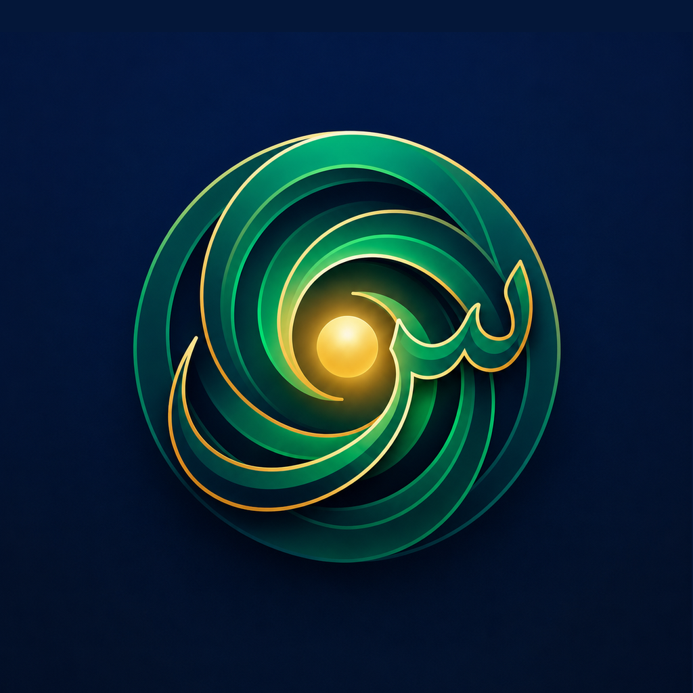
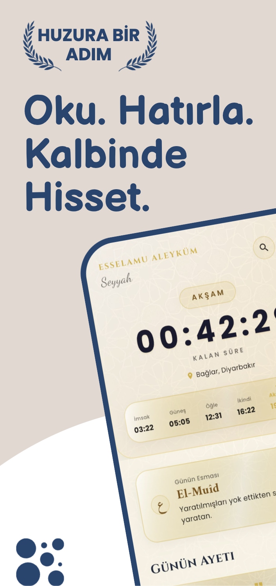
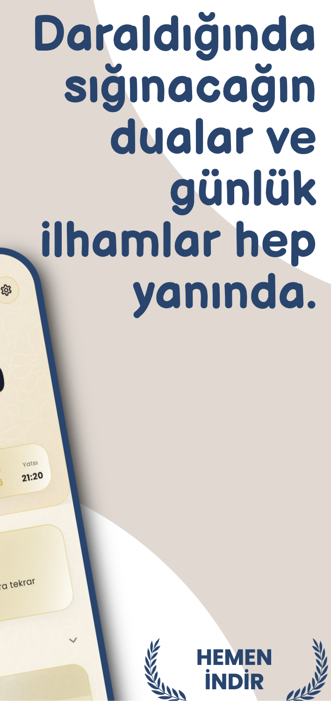
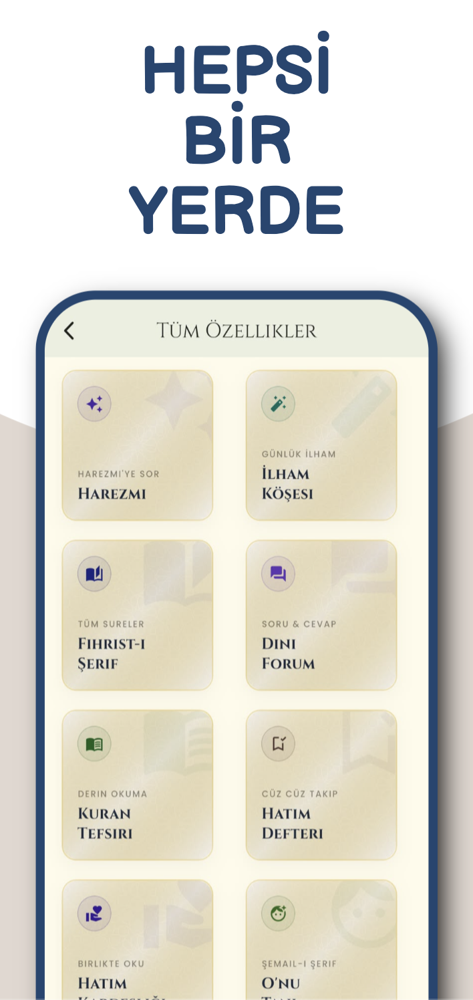
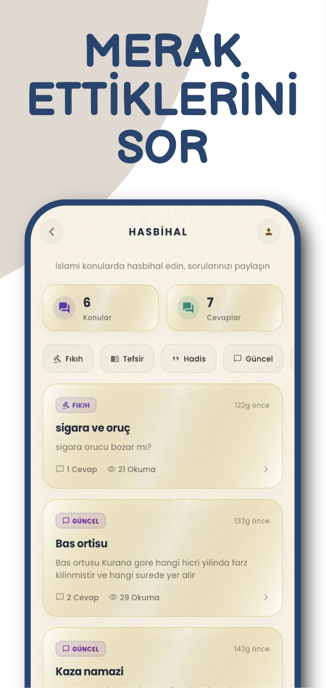
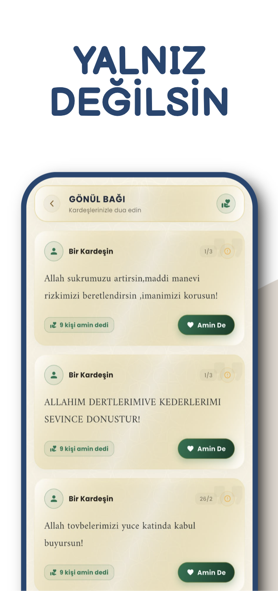
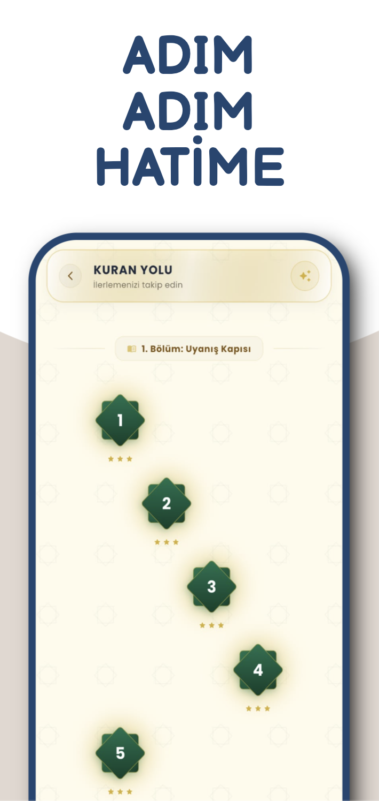
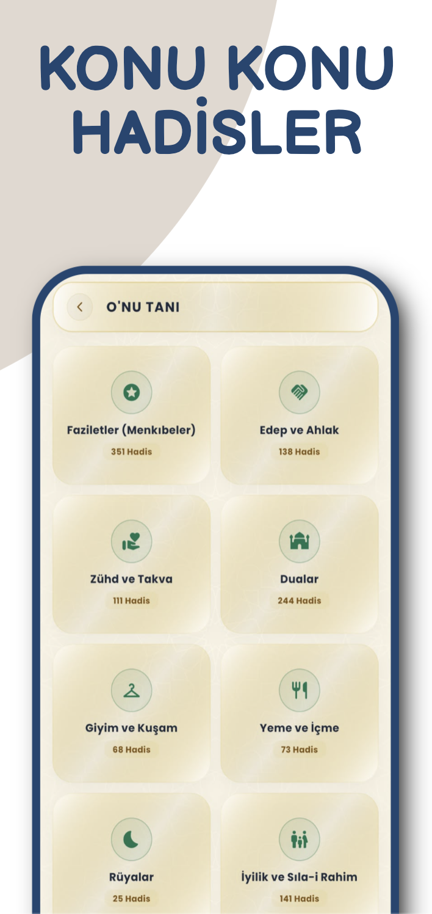
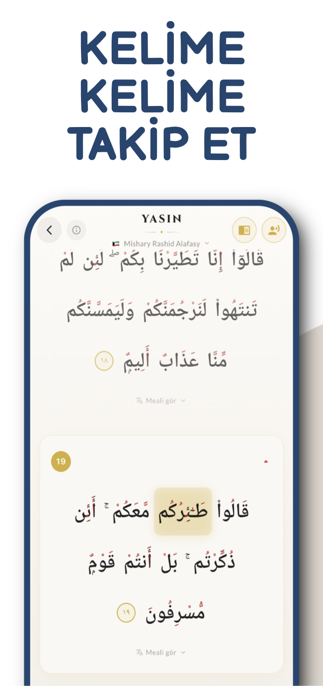

  

<h1 align="center">Seyr</h1>

  <strong>A comprehensive Islamic mobile application built with Flutter.</strong>

  A modern digital companion designed for Islamic life, worship, learning, and spiritual growth.

---

## About
## About

Seyr is a mobile application designed to bring essential tools and content for Islamic life together in a single, modern experience.

The application is built with a focus on accessibility, simplicity, and everyday usability. Rather than focusing on a single feature, Seyr aims to provide users with a broader digital companion for religious content, worship-related tools, and daily spiritual routines.

---

## Features

Seyr includes a growing set of features focused on:

- Islamic content and religious resources
- Quran-related features
- Worship-focused tools
- Personal progress tracking
- Daily spiritual routines
- User accounts and synchronization
- Offline-accessible content
- Clean and simple mobile experience

---

## Screenshots

  
  
  
  

  
  
  
  

---

## Tech Stack

### Mobile
- Flutter
- Dart

### Backend & Services
- Firebase
- REST APIs

### Data
- JSON-based local data
- Offline content management

### Development Tools
- Git
- GitHub

---

## Development

Seyr is an actively developed independent mobile application.

The project is structured to support the addition of new religious content, tools, and features over time while maintaining a consistent and simple user experience.

---

## Source Code

The source code of Seyr is maintained in a private repository and is not publicly distributed.

This repository serves as a public showcase for the application, including its interface, features, technologies, and development progress.

---

## Developer

**Mahmut Ersoy**

Information Systems & Technologies  
Data Science • Python Development • Flutter

- LinkedIn: linkedin.com/in/mahmut-ersoy-6a7554310
- Email: mersoy.datasc@gmail.com

---

## Status

🚧 Seyr is currently under active development.
